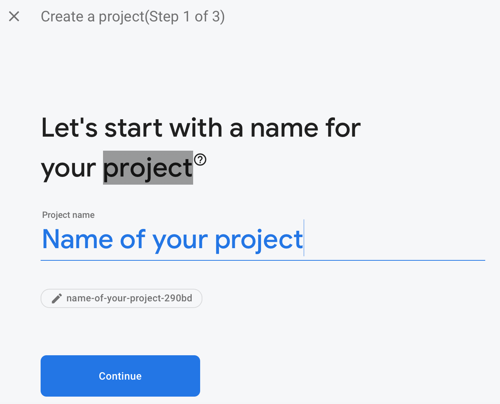
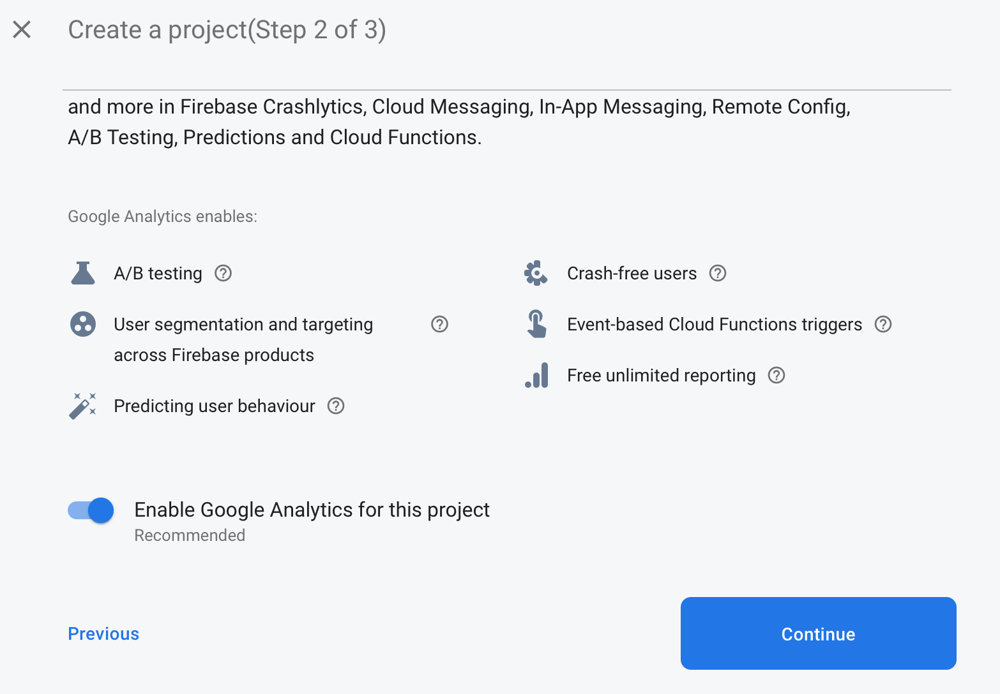
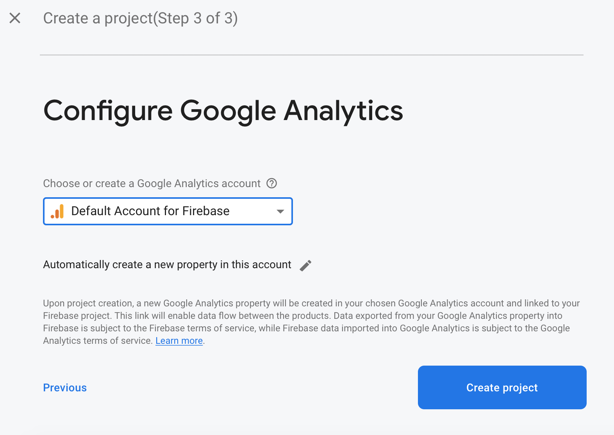
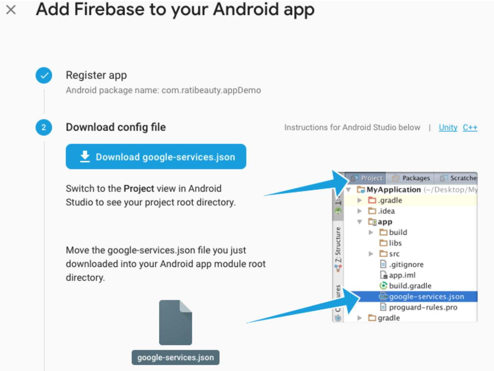
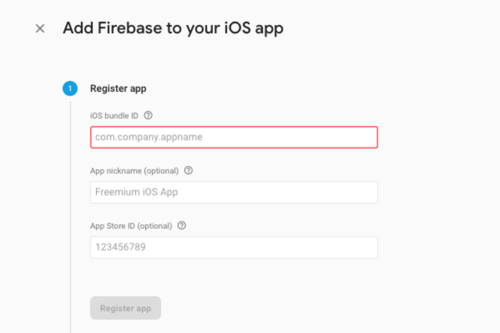
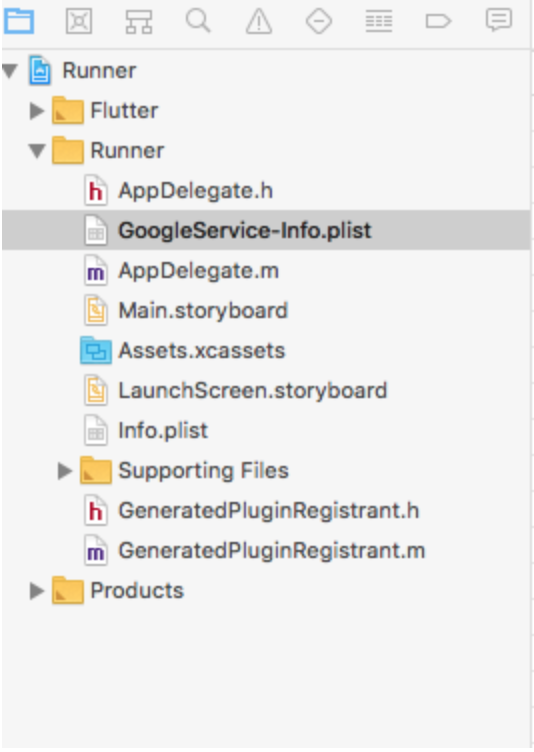
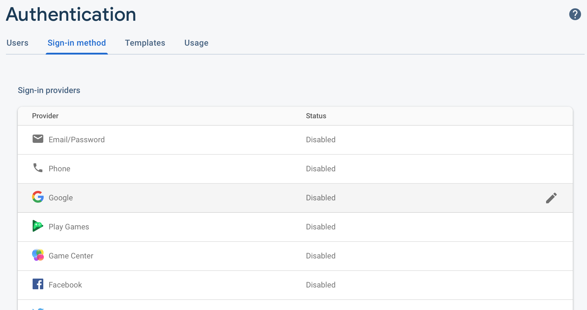
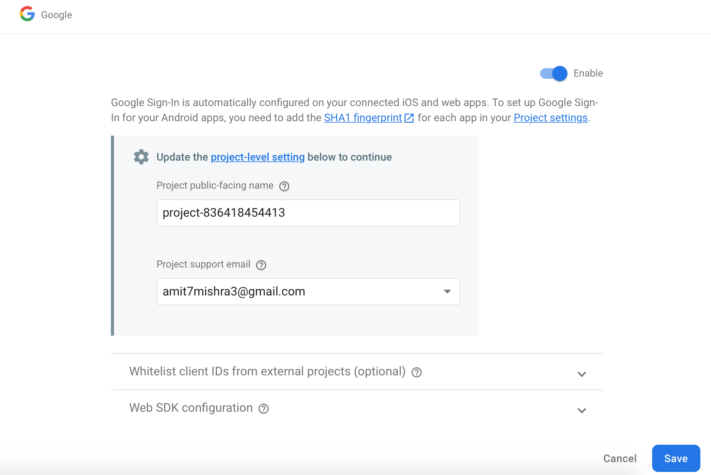
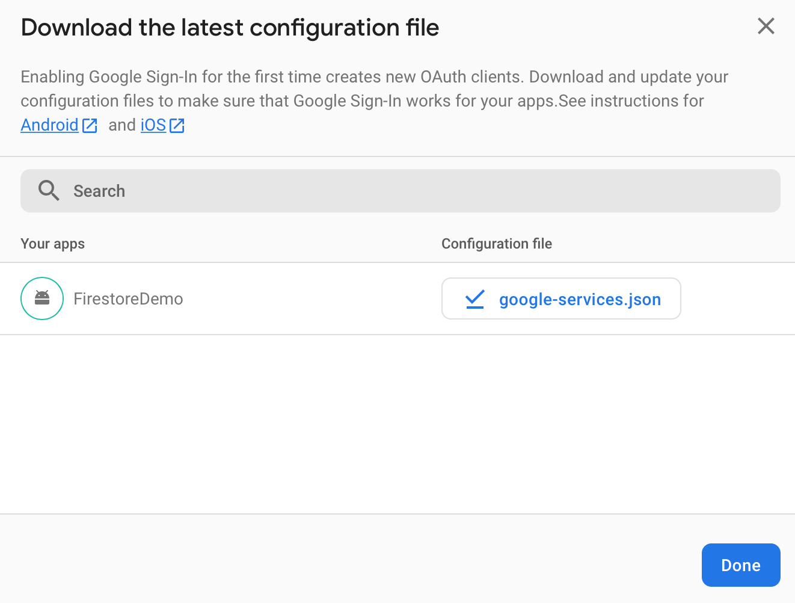

# Google Sign In

A simple demo of google authentication using firebase.


Hello people! Today we are going to learn how to implement google authentication in our flutter app using `google_sign_in`.

**Firebase Authentication** aims to make building secure authentication systems easy, while improving the sign-in and onboarding experience for end users. It provides an end-to-end identity solution, supporting email and password accounts, phone auth, and Google, Twitter, Facebook, and GitHub login, and more. In this project we will focus on **Google Sign In** and its implementation.

        #Firebase Authenticatio
        #“Simple, free multi-platform sign-in”

Lets begin!!!

## Step 1 : Project Setup

First things first! Go ahead and create a project in firebase console.

Create a new project in [Google Firebase Console](https://console.firebase.google.com/)



Once you provide the project name click on continue.



This is optional. You can disable the toggle if you don't want google analytics for your project. Once done click continue.



If your opt for google analytics then select the account for it as shown above.

### Android

The next step is to add firebase to android app.


Once done. Go ahead and download the `google-services.json` file and place it in your project as shown. You can skip this step for now as we are going to add this after selecting `Authentication`.



Then add the below line of code to your `app/build.gradle` file.

```

apply plugin: 'com.google.gms.google-services'

```

Next step is to add the below line of code to your `project/build.gradle` file.

```

classpath 'com.google.gms:google-services:4.2.0'

```

### iOS

Add ios app to firebase with the bundle id of your App.



Go ahead and download the `GoogleService-info.plist` file and place it in your project as shown. You can skip this step for now as we are going to add this after selecting `Authentication`.



Place the below line of codes in the `[my_project]/ios/Runner/Info.plist` file.

```
<!-- Google Sign-in Section -->
<key>CFBundleURLTypes</key>
<array>
	<dict>
		<key>CFBundleTypeRole</key>
		<string>Editor</string>
		<key>CFBundleURLSchemes</key>
		<array>
			<!-- TODO Replace this value: -->
			<!-- Copied from GoogleService-Info.plist key REVERSED_CLIENT_ID -->
			<string>com.googleusercontent.apps.861823949799-vc35cprkp249096uujjn0vvnmcvjppkn</string>
		</array>
	</dict>
</array>
<!-- End of the Google Sign-in Section -->
```

### Add Google Authentication

Go ahead and select `Authentication` and click on `Get Started` to add authentication to our project.


Select Google as the Sign-in Method as show below.



Enable google login for our app and provide the support email address as show below.



Download the latest `google-services.json` and `GoogleService-info.plist` files and place it in respective android and ios directories as directed above.



That's it folks! Now we are all set with the project setup. Let's move ahead on the flutter side of our project.

## Step 2 :  Install Packages

Place the below dependencies in your `pubspec.yaml` file and run `flutter pub get`
```
  
  google_sign_in: ^5.0.1
  
```

## Step 3 : Create Google Sing In Instance

```

GoogleSignIn googleSignIn = GoogleSignIn(
    scopes: [
      'email',
    ],
  );

```

## Step 4 : Sign In and Sign Out

`googleSignIn.signIn()` is used to sign in and `googleSignIn.signOut()` is used to sign out and already logged in user.

```

Future<void> signIn() async {
    try {
      await googleSignIn.signIn();
      setState(() {
        isLoggedIn = true;
      });
    } catch (error) {
      print(error);
    }
  }

  Future<void> signOut() async {
    try {
      await googleSignIn.signOut();
      setState(() {
        isLoggedIn = false;
      });
    } catch (error) {
      print(error);
    }
  }
```

## Step 5 : User Info

We can fetch the user information from the `GoogleSignIn` as shown below.

```
 Widget buildUserInfo() {
    return Column(
      mainAxisAlignment: MainAxisAlignment.center,
      children: [
        Image.network(googleSignIn.currentUser.photoUrl),
        SizedBox(height: 10,),
        Text(googleSignIn.currentUser.displayName,style: TextStyle(fontSize: 20),),
        SizedBox(height: 10,),
        Text(googleSignIn.currentUser.email,style: TextStyle(fontSize: 16),),
        SizedBox(height: 10,),
        buildSignOutButton(),
      ],
    );
  }
```

That's it folks! We're done with all the coding. Just go ahead and run your app!

Fantastic!! You have just learned how to authenticate user via `Google Sign In`.

## Important:

This repository is only for demonstrating `google_sign_in`. Please do not misuse it.

## Author:

* [Amit Mishra](https://github.com/amitmishra7)

If you like this tutorial please don't forget to add a **Star**. Also follow to get informed for upcoming tutorials.
